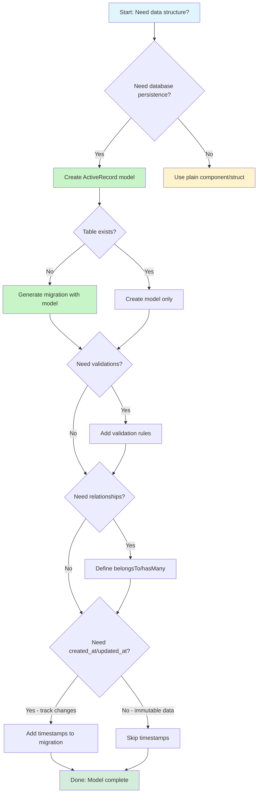

# Decision Tree: Creating a Model

Guide for AI agents and developers to determine when and how to create models in Fuse, with decision points for migrations, validations, relationships, and timestamps.

## Overview

This decision tree helps determine:
- When to create a model vs plain component
- Whether to generate migrations
- When to add validations
- How to define relationships
- Whether timestamps are needed

Use this flowchart to make consistent decisions about model creation across your Fuse application.

## Decision Flowchart



## Decision Points

### 1. Need Database Persistence?

**Question:** Will this data be stored in and retrieved from a database?

**Yes → Create ActiveRecord Model**

```cfml
// app/models/User.cfc
component extends="fuse.orm.ActiveRecord" {

    public function init(datasource) {
        super.init(datasource);
        return this;
    }
}
```

Use models when:
- Data persists across requests
- Need CRUD operations
- Querying database tables
- Data integrity matters (validations)
- Relationships with other models

**No → Use Plain Component or Struct**

```cfml
// app/services/EmailFormatter.cfc
component {

    public string function format(required string email) {
        return lcase(trim(arguments.email));
    }
}
```

Use plain components for:
- Business logic without persistence
- Stateless services
- Utility functions
- DTOs (data transfer objects)
- API response formatters

### 2. Need Migrations?

**Question:** Does the database table for this model already exist?

**No (New table) → Generate Migration with Model**

```bash
# Generate model with migration automatically
$ lucli generate model User name:string email:string age:integer

Creating model...
  ✓ Created app/models/User.cfc
  ✓ Created tests/models/UserTest.cfc
  ✓ Created migrations/2025-11-06-123456-create-users.cfc
```

Generated migration:

```cfml
// migrations/2025-11-06-123456-create-users.cfc
component {

    public void function up(schema) {
        schema.createTable("users", function(table) {
            table.increments("id");
            table.string("name");
            table.string("email");
            table.integer("age");
            table.timestamps();
        });
    }

    public void function down(schema) {
        schema.dropTable("users");
    }
}
```

**Yes (Table exists) → Create Model Only**

```bash
# Create model for existing table
$ lucli generate model User --skip-migration
```

Or manually:

```cfml
// app/models/User.cfc
component extends="fuse.orm.ActiveRecord" {

    public function init(datasource) {
        super.init(datasource);
        // Fuse uses convention: table = "users"
        return this;
    }
}
```

### 3. Need Validations?

**Question:** Should this model validate data before saving to database?

**Yes → Add Validation Rules**

```cfml
// app/models/User.cfc
component extends="fuse.orm.ActiveRecord" {

    public function init(datasource) {
        super.init(datasource);

        // Add validation rules
        this.validates("email", {
            required: true,
            email: true,
            unique: true
        });

        this.validates("name", {
            required: true,
            length: {min: 2, max: 100}
        });

        this.validates("age", {
            numeric: true,
            range: {min: 0, max: 150}
        });

        return this;
    }
}
```

Add validations when:
- User input needs verification
- Business rules must be enforced
- Data integrity is critical
- Want friendly error messages

**No → Skip Validations**

```cfml
// app/models/LogEntry.cfc
component extends="fuse.orm.ActiveRecord" {

    public function init(datasource) {
        super.init(datasource);
        // No validations - logging system writes trusted data
        return this;
    }
}
```

Skip validations for:
- System-generated data (logs, metrics)
- Data already validated upstream
- Simple lookup tables
- Migration/seed data

### 4. Need Relationships?

**Question:** Does this model relate to other models?

**Yes → Define Relationships**

```cfml
// app/models/User.cfc
component extends="fuse.orm.ActiveRecord" {

    public function init(datasource) {
        super.init(datasource);

        // Define relationships
        this.hasMany("posts");
        this.hasMany("comments");
        this.hasOne("profile");

        return this;
    }
}
```

```cfml
// app/models/Post.cfc
component extends="fuse.orm.ActiveRecord" {

    public function init(datasource) {
        super.init(datasource);

        // Inverse relationship
        this.belongsTo("user");
        this.hasMany("comments");

        return this;
    }
}
```

Define relationships when:
- Models reference each other via foreign keys
- Need to load related records
- Want to prevent N+1 queries (with eager loading)
- Data has natural associations

**No → Skip Relationships**

```cfml
// app/models/Configuration.cfc
component extends="fuse.orm.ActiveRecord" {

    public function init(datasource) {
        super.init(datasource);
        // No relationships - standalone config table
        return this;
    }
}
```

Skip relationships for:
- Standalone tables (configuration, settings)
- Lookup tables without associations
- Simple key-value stores

### 5. Need Timestamps?

**Question:** Do you need to track when records are created and updated?

**Yes → Add Timestamps to Migration**

```cfml
// migrations/2025-11-06-123456-create-posts.cfc
component {

    public void function up(schema) {
        schema.createTable("posts", function(table) {
            table.increments("id");
            table.string("title");
            table.text("body");
            table.timestamps();  // Adds created_at and updated_at
        });
    }

    public void function down(schema) {
        schema.dropTable("posts");
    }
}
```

Model automatically populates timestamps:

```cfml
var post = new Post(datasource);
post.title = "My Post";
post.save();

// Timestamps automatically set
writeDump(post.created_at);  // 2025-11-06 14:30:00
writeDump(post.updated_at);  // 2025-11-06 14:30:00

// Update automatically updates updated_at
post.title = "Updated Title";
post.save();
writeDump(post.updated_at);  // 2025-11-06 15:45:00 (changed)
writeDump(post.created_at);  // 2025-11-06 14:30:00 (unchanged)
```

Use timestamps when:
- Need audit trail
- Tracking data changes
- Sorting by creation/modification time
- Debugging data issues

**No → Skip Timestamps**

```cfml
// migrations/2025-11-06-123456-create-countries.cfc
component {

    public void function up(schema) {
        schema.createTable("countries", function(table) {
            table.increments("id");
            table.string("code", 2);
            table.string("name");
            // No timestamps() - lookup data doesn't change
        });
    }

    public void function down(schema) {
        schema.dropTable("countries");
    }
}
```

Skip timestamps for:
- Static reference data (countries, states)
- Lookup tables
- Immutable records
- Tables where timestamps add no value

## Complete Example

Here's a complete example with all decision points:

```bash
# 1. Generate model with migration
$ lucli generate model Post title:string body:text user_id:integer published_at:datetime
```

```cfml
// app/models/Post.cfc
component extends="fuse.orm.ActiveRecord" {

    public function init(datasource) {
        super.init(datasource);

        // 2. Add validations
        this.validates("title", {
            required: true,
            length: {min: 5, max: 200}
        });

        this.validates("body", {
            required: true,
            length: {min: 10}
        });

        this.validates("user_id", {
            required: true,
            numeric: true
        });

        // 3. Define relationships
        this.belongsTo("user");
        this.hasMany("comments");

        return this;
    }
}
```

```cfml
// migrations/2025-11-06-123456-create-posts.cfc
component {

    public void function up(schema) {
        schema.createTable("posts", function(table) {
            table.increments("id");
            table.string("title");
            table.text("body");
            table.integer("user_id");
            table.datetime("published_at");
            table.timestamps();  // 4. Add timestamps
        });
    }

    public void function down(schema) {
        schema.dropTable("posts");
    }
}
```

Run migration:

```bash
$ lucli migrate
```

Use the model:

```cfml
var post = new Post(datasource);
post.title = "My First Post";
post.body = "This is the content of my first post.";
post.user_id = 1;
post.published_at = now();

if (post.save()) {
    // Success - validation passed, saved to database
    writeDump(post.id);          // 1 (auto-generated)
    writeDump(post.created_at);  // 2025-11-06 14:30:00 (auto-set)

    // Access relationships
    var author = post.user().first();
    var comments = post.comments().get();
} else {
    // Validation failed
    writeDump(post.getErrors());
}
```

## Quick Reference

| Decision | Yes → Action | No → Alternative |
|----------|-------------|------------------|
| Need persistence? | Create ActiveRecord model | Use plain component |
| Table exists? | Skip migration | Generate migration |
| Need validations? | Add `this.validates()` | Skip validations |
| Need relationships? | Add `hasMany/belongsTo` | Skip relationships |
| Need timestamps? | Add `table.timestamps()` | Skip timestamp columns |

## Related Topics

- [Models & ORM](../../guides/models-orm.md) - Complete model documentation
- [Migrations](../../guides/migrations.md) - Database schema management
- [Validations](../../guides/validations.md) - Validation rules and patterns
- [Relationships](../../guides/relationships.md) - Defining model associations
- [CLI Reference](../../reference/cli-reference.md) - Generator commands
