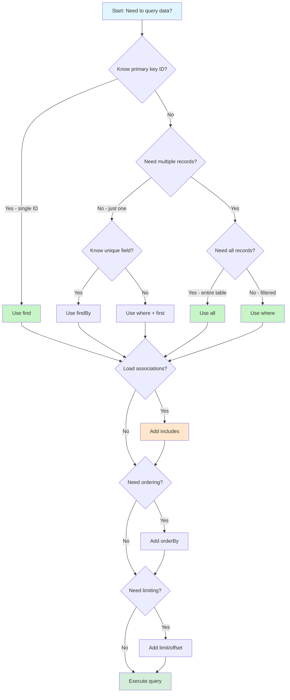

# Decision Tree: Querying Data

Guide for AI agents and developers to choose optimal query methods in Fuse, with decision points for finding records, filtering, eager loading, and performance optimization.

## Overview

This decision tree helps determine:
- Which query method to use (find vs where vs all)
- When to eager load associations
- How to optimize query performance
- When to order, limit, or paginate results

Use this flowchart to write efficient, performant queries across your Fuse application.

## Decision Flowchart



## Decision Points

### 1. Know Primary Key ID?

**Question:** Are you retrieving a single record by its primary key?

**Yes → Use find()**

```cfml
// Find user by primary key (id)
var user = User::find(1);

if (isNull(user)) {
    // Record not found
} else {
    writeDump(user.name);
}
```

**Multiple IDs:**

```cfml
// Find multiple users by IDs
var users = User::find([1, 2, 3]);
// Returns array of User objects
```

**No → Continue to next decision point**

### 2. Need Multiple Records?

**Question:** Do you need more than one record, or just one with specific criteria?

**Just one record → Use findBy() or where().first()**

```cfml
// Find single user by email
var user = User::findBy("email", "john@example.com");

// Or with where + first
var user = User::where({email: "john@example.com"}).first();
```

**Multiple records → Continue to next decision point**

### 3. Need All Records?

**Question:** Do you want every record from the table?

**Yes → Use all()**

```cfml
// Get all users
var users = User::all();

// Returns array of all User objects
for (var user in users) {
    writeDump(user.name);
}
```

**Warning:** Be cautious with large tables. Consider pagination.

**No (filtered records) → Use where()**

```cfml
// Get active users only
var activeUsers = User::where({active: true}).get();

// Multiple conditions
var admins = User::where({
    active: true,
    role: "admin"
}).get();
```

### 4. Load Associations?

**Question:** Do you need related records from associated models?

**Yes → Use includes() for Eager Loading**

```cfml
// Load users with their posts (prevents N+1 queries)
var users = User::includes("posts").all();

for (var user in users) {
    writeDump(user.name);
    // Posts already loaded - no additional query
    var posts = user.posts().get();
}
```

**Multiple associations:**

```cfml
// Load multiple associations
var users = User::includes(["posts", "comments", "profile"]).all();
```

**Nested associations:**

```cfml
// Load posts with their comments
var users = User::includes({
    posts: "comments"
}).all();
```

**No → Skip eager loading**

```cfml
// Just users, no associations
var users = User::where({active: true}).get();
```

### 5. Need Ordering?

**Question:** Should results be sorted?

**Yes → Use orderBy()**

```cfml
// Order by single column
var users = User::orderBy("created_at DESC").get();

// Order by multiple columns
var users = User::orderBy("role ASC, name ASC").get();

// Order with where
var recentPosts = Post::where({published: true})
    .orderBy("published_at DESC")
    .get();
```

**No → Continue to next decision point**

### 6. Need Limiting?

**Question:** Should results be limited or paginated?

**Yes → Use limit() and offset()**

```cfml
// First 10 records
var users = User::limit(10).get();

// Pagination: page 2, 10 per page
var page = 2;
var perPage = 10;
var users = User::limit(perPage)
    .offset((page - 1) * perPage)
    .get();

// Recent posts with limit
var recentPosts = Post::where({published: true})
    .orderBy("published_at DESC")
    .limit(5)
    .get();
```

**No → Execute query without limit**

## Performance Implications

### N+1 Query Problem

**Problem:** Loading associations in a loop generates excessive queries.

```cfml
// Anti-pattern: N+1 queries
var users = User::all();  // 1 query

for (var user in users) {
    // Each iteration executes a new query (N queries)
    var posts = user.posts().get();
}
// Total: 1 + N queries (if 100 users = 101 queries!)
```

**Solution:** Eager load with includes()

```cfml
// Good: 2 queries total
var users = User::includes("posts").all();  // 2 queries (users + posts)

for (var user in users) {
    // No query - posts already loaded
    var posts = user.posts().get();
}
// Total: 2 queries (regardless of user count)
```

### Query Chaining Performance

Query methods are chainable and lazy - they don't execute until needed:

```cfml
// No query executed yet
var query = User::where({active: true})
    .orderBy("created_at DESC")
    .limit(10);

// Query executes when calling terminal method
var users = query.get();  // SQL executes here
```

Terminal methods that execute queries:
- `get()` - Returns array of records
- `first()` - Returns single record or null
- `count()` - Returns count
- `exists()` - Returns boolean

### Index Usage

Use database indexes for frequently queried columns:

```cfml
// Migration: Add index to email column
table.index("email");

// Now queries on email are fast
var user = User::findBy("email", "john@example.com");
```

## Query Method Reference

### Static Query Methods

| Method | Use Case | Returns | Example |
|--------|----------|---------|---------|
| `find(id)` | Single record by ID | Object or null | `User::find(1)` |
| `find([ids])` | Multiple records by IDs | Array | `User::find([1,2,3])` |
| `findBy(column, value)` | Single record by column | Object or null | `User::findBy("email", "john@example.com")` |
| `where(conditions)` | Filtered records | QueryBuilder | `User::where({active: true})` |
| `all()` | All records | Array | `User::all()` |
| `includes(associations)` | Eager load associations | QueryBuilder | `User::includes("posts")` |

### QueryBuilder Chain Methods

| Method | Purpose | Example |
|--------|---------|---------|
| `where(conditions)` | Add WHERE clause | `.where({active: true})` |
| `orderBy(column)` | Add ORDER BY | `.orderBy("created_at DESC")` |
| `limit(count)` | Limit results | `.limit(10)` |
| `offset(count)` | Skip records | `.offset(20)` |
| `includes(associations)` | Eager load | `.includes("posts")` |
| `get()` | Execute and return array | `.get()` |
| `first()` | Execute and return first | `.first()` |
| `count()` | Count matching records | `.count()` |

## Complete Examples

### Example 1: Simple Find

```cfml
// Find user by ID
var user = User::find(1);

if (!isNull(user)) {
    writeDump(user.name);
    writeDump(user.email);
}
```

### Example 2: Filtered Query with Ordering

```cfml
// Get published posts, newest first
var publishedPosts = Post::where({published: true})
    .orderBy("published_at DESC")
    .get();

for (var post in publishedPosts) {
    writeDump(post.title);
}
```

### Example 3: Paginated Results

```cfml
// Page 1: First 20 users
var page1Users = User::orderBy("name ASC")
    .limit(20)
    .offset(0)
    .get();

// Page 2: Next 20 users
var page2Users = User::orderBy("name ASC")
    .limit(20)
    .offset(20)
    .get();
```

### Example 4: Eager Loading Single Association

```cfml
// Load users with posts (2 queries total)
var users = User::includes("posts").all();

for (var user in users) {
    writeDump(user.name);

    // Posts already loaded - no additional query
    var posts = user.posts().get();
    for (var post in posts) {
        writeDump(post.title);
    }
}
```

### Example 5: Eager Loading Multiple Associations

```cfml
// Load users with posts and profile (3 queries total)
var users = User::includes(["posts", "profile"])
    .where({active: true})
    .get();

for (var user in users) {
    var posts = user.posts().get();      // No query
    var profile = user.profile().first(); // No query
}
```

### Example 6: Nested Eager Loading

```cfml
// Load users, their posts, and each post's comments (3 queries total)
var users = User::includes({
    posts: "comments"
}).all();

for (var user in users) {
    var posts = user.posts().get();  // No query

    for (var post in posts) {
        var comments = post.comments().get();  // No query
        writeDump(comments);
    }
}
```

### Example 7: Complex Query

```cfml
// Active admin users with posts, ordered by name, paginated
var adminUsers = User::where({
        active: true,
        role: "admin"
    })
    .includes("posts")
    .orderBy("name ASC")
    .limit(20)
    .offset(0)
    .get();
```

### Example 8: Count Records

```cfml
// Count active users
var activeCount = User::where({active: true}).count();

// Count published posts
var publishedCount = Post::where({published: true}).count();

// Check if any records exist
var hasAdmins = User::where({role: "admin"}).exists();
```

## Common Patterns

### Pattern: Load Related Records

```cfml
// Load user and their posts
var user = User::find(1);
var posts = user.posts().get();

// With conditions
var publishedPosts = user.posts()
    .where({published: true})
    .get();
```

### Pattern: Search by Multiple Fields

```cfml
// Find users matching multiple criteria
var results = User::where({
    role: "admin",
    active: true,
    department: "Engineering"
}).get();
```

### Pattern: Recent Records

```cfml
// Get 10 most recent posts
var recentPosts = Post::orderBy("created_at DESC")
    .limit(10)
    .get();
```

### Pattern: Check Existence

```cfml
// Check if user exists
var userExists = User::where({email: "john@example.com"}).exists();

if (userExists) {
    // Email already taken
}
```

## Anti-Patterns

### Anti-Pattern: N+1 Queries

**Don't:**

```cfml
var users = User::all();

for (var user in users) {
    var posts = user.posts().get();  // N queries!
}
```

**Do:**

```cfml
var users = User::includes("posts").all();

for (var user in users) {
    var posts = user.posts().get();  // No additional query
}
```

### Anti-Pattern: Loading All Records on Large Tables

**Don't:**

```cfml
var allUsers = User::all();  // Could be millions of records!
```

**Do:**

```cfml
// Paginate instead
var users = User::limit(50).offset(0).get();

// Or use specific criteria
var activeUsers = User::where({active: true}).get();
```

### Anti-Pattern: Multiple Queries for Single Record

**Don't:**

```cfml
var users = User::where({email: "john@example.com"}).get();
var user = users[1];
```

**Do:**

```cfml
var user = User::findBy("email", "john@example.com");
// or
var user = User::where({email: "john@example.com"}).first();
```

## Quick Reference

| Scenario | Method | Example |
|----------|--------|---------|
| One record by ID | `find(id)` | `User::find(1)` |
| One record by field | `findBy(column, value)` | `User::findBy("email", "john@example.com")` |
| All records | `all()` | `User::all()` |
| Filtered records | `where({}).get()` | `User::where({active: true}).get()` |
| With associations | `includes().get()` | `User::includes("posts").get()` |
| Ordered results | `orderBy().get()` | `User::orderBy("name ASC").get()` |
| Limited results | `limit().get()` | `User::limit(10).get()` |
| Count records | `count()` | `User::where({active: true}).count()` |
| Check existence | `exists()` | `User::where({email: email}).exists()` |

## Related Topics

- [Models & ORM](../../guides/models-orm.md) - Model basics and conventions
- [Eager Loading](../../guides/eager-loading.md) - Preventing N+1 queries
- [Relationships](../../guides/relationships.md) - Defining model associations
- [Performance](../../advanced/performance.md) - Query optimization strategies
- [API Reference](../../reference/api-reference.md) - Complete method documentation
