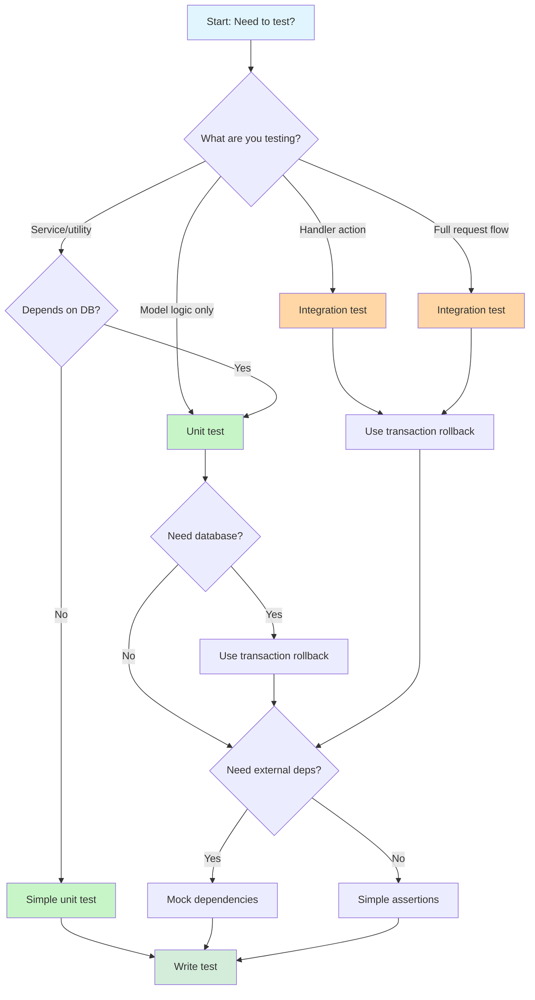

# Decision Tree: Testing Strategy

Guide for AI agents and developers to choose appropriate test types in Fuse, with decision points for unit vs integration tests, database handling, and mocking strategies.

## Overview

This decision tree helps determine:
- When to write unit vs integration tests
- Whether tests need database access
- When to use transaction rollback
- When to mock dependencies
- Test organization patterns

Use this flowchart to create comprehensive, maintainable test suites for your Fuse application.

## Decision Flowchart



## Decision Points

### 1. What Are You Testing?

**Question:** What component or behavior needs testing?

**Model Logic → Unit Test**

Test model validations, business logic, and methods in isolation.

```cfml
// tests/models/UserTest.cfc
component extends="fuse.testing.TestCase" {

    public function setup() {
        variables.user = new app.models.User(getDatasource());
    }

    public function testEmailValidation() {
        variables.user.email = "invalid";
        assertFalse(variables.user.isValid());
        assertContains("is not a valid email", variables.user.getErrors("email"));
    }

    public function testFullNameMethod() {
        variables.user.firstName = "John";
        variables.user.lastName = "Doe";
        assertEquals("John Doe", variables.user.getFullName());
    }
}
```

**Handler Action → Integration Test**

Test handler actions with database, including full request/response cycle.

```cfml
// tests/handlers/UsersHandlerTest.cfc
component extends="fuse.testing.TestCase" {

    public function setup() {
        variables.handler = new app.handlers.Users();
        variables.datasource = getDatasource();
    }

    public function testIndexReturnsActiveUsers() {
        // Create test data
        var user1 = createUser({name: "John", active: true});
        var user2 = createUser({name: "Jane", active: false});

        // Call handler action
        var result = variables.handler.index();

        // Assert response structure
        assertTrue(structKeyExists(result, "users"));
        assertEquals(1, arrayLen(result.users));
        assertEquals("John", result.users[1].name);
    }
}
```

**Full Request Flow → Integration Test**

Test complete HTTP request/response with routing, handler, model, and database.

```cfml
// tests/integration/PostWorkflowTest.cfc
component extends="fuse.testing.TestCase" {

    public function testCreatePostWorkflow() {
        var user = createUser({name: "Author"});

        // Simulate POST request
        var response = post("/posts", {
            title: "My Post",
            body: "Post content",
            user_id: user.id
        });

        // Verify response
        assertEquals(201, response.status);
        assertTrue(structKeyExists(response.data, "post"));

        // Verify database
        var post = Post::findBy("title", "My Post");
        assertNotNull(post);
        assertEquals(user.id, post.user_id);
    }
}
```

**Service/Utility → Depends on Database**

If service uses database, treat as unit test with database.
If purely business logic, simple unit test.

```cfml
// tests/services/EmailServiceTest.cfc
component extends="fuse.testing.TestCase" {

    public function setup() {
        variables.emailService = new app.services.EmailService();
    }

    public function testEmailFormatting() {
        var formatted = variables.emailService.format("  JOHN@EXAMPLE.COM  ");
        assertEquals("john@example.com", formatted);
    }
}
```

### 2. Need Database?

**Question:** Does this test require database access?

**Yes → Use Transaction Rollback**

Fuse automatically wraps each test in a database transaction and rolls it back after the test completes.

```cfml
// tests/models/PostTest.cfc
component extends="fuse.testing.TestCase" {

    public function testCreatePost() {
        var post = new Post(getDatasource());
        post.title = "Test Post";
        post.body = "Content";

        assertTrue(post.save());
        assertGreaterThan(0, post.id);

        // Database changes automatically rolled back after test
    }

    public function testAnotherPost() {
        // Clean database state - previous test rolled back
        var count = Post::count();
        assertEquals(0, count);  // No posts from previous test
    }
}
```

**No → Skip Database Setup**

Pure logic tests don't need database.

```cfml
// tests/unit/StringHelperTest.cfc
component extends="fuse.testing.TestCase" {

    public function testSlugify() {
        var helper = new app.helpers.StringHelper();
        assertEquals("hello-world", helper.slugify("Hello World!"));
    }
}
```

### 3. Need External Dependencies?

**Question:** Does the code depend on external services or components?

**Yes → Mock Dependencies**

Mock external APIs, email services, payment processors, etc.

```cfml
// tests/services/PaymentServiceTest.cfc
component extends="fuse.testing.TestCase" {

    public function setup() {
        // Mock payment gateway
        variables.mockGateway = createMock("PaymentGateway");
        variables.paymentService = new app.services.PaymentService(
            variables.mockGateway
        );
    }

    public function testSuccessfulPayment() {
        // Configure mock
        variables.mockGateway.charge = function(amount) {
            return {success: true, transactionId: "12345"};
        };

        var result = variables.paymentService.processPayment(100);

        assertTrue(result.success);
        assertEquals("12345", result.transactionId);
    }
}
```

**No → Simple Assertions**

Test behavior directly without mocks.

```cfml
// tests/models/UserTest.cfc
component extends="fuse.testing.TestCase" {

    public function testUserValidation() {
        var user = new User(getDatasource());
        user.email = "invalid";

        assertFalse(user.isValid());
    }
}
```

## Test Type Examples

### Unit Test: Model Validation

```cfml
// tests/models/UserTest.cfc
component extends="fuse.testing.TestCase" {

    public function setup() {
        variables.user = new app.models.User(getDatasource());
    }

    public function testRequiredFields() {
        // Empty user should fail validation
        assertFalse(variables.user.isValid());

        var errors = variables.user.getErrors();
        assertTrue(structKeyExists(errors, "email"));
        assertTrue(structKeyExists(errors, "name"));
    }

    public function testEmailFormat() {
        variables.user.name = "John Doe";
        variables.user.email = "not-an-email";

        assertFalse(variables.user.isValid());
        assertContains("is not a valid email", variables.user.getErrors("email"));
    }

    public function testValidUser() {
        variables.user.name = "John Doe";
        variables.user.email = "john@example.com";

        assertTrue(variables.user.isValid());
        assertTrue(variables.user.save());
        assertGreaterThan(0, variables.user.id);
    }
}
```

### Unit Test: Model Business Logic

```cfml
// tests/models/PostTest.cfc
component extends="fuse.testing.TestCase" {

    public function setup() {
        variables.post = new app.models.Post(getDatasource());
    }

    public function testIsPublished() {
        // Not published if published_at is null
        assertFalse(variables.post.isPublished());

        // Not published if published_at is in future
        variables.post.published_at = dateAdd("d", 1, now());
        assertFalse(variables.post.isPublished());

        // Published if published_at is in past
        variables.post.published_at = dateAdd("d", -1, now());
        assertTrue(variables.post.isPublished());
    }

    public function testPublish() {
        assertNull(variables.post.published_at);

        variables.post.publish();

        assertNotNull(variables.post.published_at);
        assertTrue(variables.post.isPublished());
    }
}
```

### Integration Test: Handler with Database

```cfml
// tests/handlers/PostsHandlerTest.cfc
component extends="fuse.testing.TestCase" {

    public function setup() {
        variables.handler = new app.handlers.Posts();
        variables.datasource = getDatasource();
    }

    public function testIndexShowsPublishedPosts() {
        // Create test data
        var publishedPost = createPost({
            title: "Published",
            published_at: dateAdd("d", -1, now())
        });
        var draftPost = createPost({
            title: "Draft",
            published_at: null
        });

        // Call handler
        var result = variables.handler.index();

        // Assert only published posts returned
        assertEquals(1, arrayLen(result.posts));
        assertEquals("Published", result.posts[1].title);
    }

    public function testShowSinglePost() {
        var post = createPost({title: "Test Post"});

        var result = variables.handler.show(post.id);

        assertTrue(structKeyExists(result, "post"));
        assertEquals("Test Post", result.post.title);
    }

    public function testCreatePost() {
        var params = {
            title: "New Post",
            body: "Post content"
        };

        var result = variables.handler.create(params);

        assertTrue(structKeyExists(result, "post"));
        assertGreaterThan(0, result.post.id);

        // Verify in database
        var post = Post::find(result.post.id);
        assertEquals("New Post", post.title);
    }

    // Helper method
    private function createPost(data) {
        var post = new Post(variables.datasource);
        for (var key in data) {
            post[key] = data[key];
        }
        post.save();
        return post;
    }
}
```

### Integration Test: Full Request Flow

```cfml
// tests/integration/BlogWorkflowTest.cfc
component extends="fuse.testing.TestCase" {

    public function testCompletePostCreationWorkflow() {
        // 1. Create user
        var user = createUser({
            name: "John Doe",
            email: "john@example.com"
        });

        // 2. Create post via handler
        var postsHandler = new app.handlers.Posts();
        var createResult = postsHandler.create({
            title: "My First Post",
            body: "This is the post content.",
            user_id: user.id
        });

        var postId = createResult.post.id;

        // 3. Add comment via handler
        var commentsHandler = new app.handlers.Comments();
        commentsHandler.create({
            post_id: postId,
            body: "Great post!",
            user_id: user.id
        });

        // 4. Verify entire workflow
        var showResult = postsHandler.show(postId);

        assertEquals("My First Post", showResult.post.title);
        assertEquals(1, arrayLen(showResult.post.comments));
        assertEquals("Great post!", showResult.post.comments[1].body);
    }

    private function createUser(data) {
        var user = new User(getDatasource());
        for (var key in data) {
            user[key] = data[key];
        }
        user.save();
        return user;
    }
}
```

### Unit Test with Mocking

```cfml
// tests/services/NotificationServiceTest.cfc
component extends="fuse.testing.TestCase" {

    public function setup() {
        // Mock email service
        variables.mockEmailService = {
            send: function(to, subject, body) {
                variables.sentEmails = variables.sentEmails ?: [];
                arrayAppend(variables.sentEmails, {
                    to: arguments.to,
                    subject: arguments.subject,
                    body: arguments.body
                });
                return true;
            }
        };

        variables.notificationService = new app.services.NotificationService(
            variables.mockEmailService
        );
    }

    public function testNotifyUserSendsEmail() {
        var user = {email: "john@example.com", name: "John"};

        variables.notificationService.notifyUser(user, "Welcome!");

        // Verify email was sent
        assertEquals(1, arrayLen(variables.sentEmails));
        assertEquals("john@example.com", variables.sentEmails[1].to);
        assertContains("Welcome", variables.sentEmails[1].subject);
    }
}
```

## Transaction Rollback

Fuse automatically wraps each test in a database transaction.

### How It Works

```cfml
component extends="fuse.testing.TestCase" {

    public function setup() {
        // Transaction begins here automatically
        variables.datasource = getDatasource();
    }

    public function testDatabaseChanges() {
        // Create records
        var user = new User(variables.datasource);
        user.name = "John";
        user.save();

        assertEquals(1, User::count());
        // Transaction will rollback after this test
    }

    public function testCleanState() {
        // Previous test rolled back - database is clean
        assertEquals(0, User::count());
    }

    public function teardown() {
        // Transaction rolls back here automatically
    }
}
```

### Benefits

- **Isolation:** Each test starts with clean database
- **Performance:** Rollback faster than DELETE statements
- **Safety:** Tests never corrupt database
- **Simplicity:** No manual cleanup needed

### Manual Control

Disable automatic rollback if needed:

```cfml
component extends="fuse.testing.TestCase" {

    this.useTransactions = false;  // Disable auto-rollback

    public function testWithCommit() {
        // Changes will persist
        var user = new User(getDatasource());
        user.name = "John";
        user.save();
    }

    public function teardown() {
        // Manual cleanup required
        User::where({name: "John"}).delete();
    }
}
```

## Test Organization

### Directory Structure

```
/tests
  /models              # Model unit tests
    UserTest.cfc
    PostTest.cfc
    CommentTest.cfc

  /handlers            # Handler integration tests
    UsersHandlerTest.cfc
    PostsHandlerTest.cfc

  /integration         # Full workflow tests
    BlogWorkflowTest.cfc
    AuthenticationTest.cfc

  /services            # Service layer tests
    EmailServiceTest.cfc
    PaymentServiceTest.cfc

  /unit                # Other unit tests
    StringHelperTest.cfc
    ValidationHelperTest.cfc
```

### Naming Conventions

- **File:** `<ComponentName>Test.cfc`
- **Class:** `component extends="fuse.testing.TestCase"`
- **Methods:** `public function test<Behavior>()`
- **Setup:** `public function setup()` (runs before each test)
- **Teardown:** `public function teardown()` (runs after each test)

### Test Method Naming

Be descriptive about what behavior is tested:

**Good:**
```cfml
public function testUserEmailValidationFailsForInvalidFormat()
public function testCreatePostRequiresAuthentication()
public function testPublishedPostsExcludeDrafts()
```

**Bad:**
```cfml
public function testEmail()
public function testPost()
public function test1()
```

## Running Tests

### Run All Tests

```bash
$ lucli test

Running tests...

UserTest
  ✓ testEmailValidation
  ✓ testRequiredFields
  ✓ testSaveUser

PostTest
  ✓ testCreatePost
  ✓ testPublish
  ✓ testIsPublished

6 tests, 6 passed, 0 failed
```

### Run Specific Test File

```bash
$ lucli test tests/models/UserTest.cfc
```

### Run Specific Test Method

```bash
$ lucli test tests/models/UserTest.cfc --method testEmailValidation
```

## Best Practices

### 1. One Assertion Per Concept

```cfml
// Good: Each test focuses on one behavior
public function testEmailRequired() {
    variables.user.email = "";
    assertFalse(variables.user.isValid());
}

public function testEmailFormat() {
    variables.user.email = "invalid";
    assertFalse(variables.user.isValid());
}

// Avoid: Testing multiple concepts
public function testEmailValidation() {
    variables.user.email = "";
    assertFalse(variables.user.isValid());

    variables.user.email = "invalid";
    assertFalse(variables.user.isValid());
}
```

### 2. Use Helper Methods

```cfml
component extends="fuse.testing.TestCase" {

    public function testUserWithPosts() {
        var user = createUser({name: "John"});
        var post = createPost({user_id: user.id, title: "Test"});

        assertEquals(1, user.posts().count());
    }

    private function createUser(data = {}) {
        var user = new User(getDatasource());
        user.name = data.name ?: "Default User";
        user.email = data.email ?: "user@example.com";
        user.save();
        return user;
    }

    private function createPost(data = {}) {
        var post = new Post(getDatasource());
        post.title = data.title ?: "Default Title";
        post.body = data.body ?: "Default body";
        post.user_id = data.user_id;
        post.save();
        return post;
    }
}
```

### 3. Test Edge Cases

```cfml
public function testDivideByZero() {
    var calculator = new Calculator();

    expectException("DivideByZeroException", function() {
        calculator.divide(10, 0);
    });
}

public function testEmptyArray() {
    var result = processArray([]);
    assertEquals([], result);
}

public function testNullInput() {
    var result = processInput(null);
    assertNull(result);
}
```

### 4. Clear Test Data

```cfml
public function testPostWithSpecificData() {
    // Clear what data represents
    var publishedPost = createPost({
        title: "Published Post",
        published_at: dateAdd("d", -1, now())
    });

    var draftPost = createPost({
        title: "Draft Post",
        published_at: null
    });

    // Test behavior is obvious
    assertTrue(publishedPost.isPublished());
    assertFalse(draftPost.isPublished());
}
```

## Quick Reference

| Testing | Test Type | Database | Mocking | Example |
|---------|-----------|----------|---------|---------|
| Model validation | Unit | Yes | No | `UserTest.testEmailValidation()` |
| Model method | Unit | No | No | `Post.testGetExcerpt()` |
| Model with DB | Unit | Yes | No | `User.testSaveUser()` |
| Handler action | Integration | Yes | No | `UsersHandler.testIndex()` |
| Full request | Integration | Yes | Maybe | `BlogWorkflow.testCreatePost()` |
| Service with API | Unit | No | Yes | `PaymentService.testCharge()` |
| Pure utility | Unit | No | No | `StringHelper.testSlugify()` |

## Related Topics

- [Testing Guide](../../guides/testing.md) - Complete testing documentation
- [Models & ORM](../../guides/models-orm.md) - Model testing patterns
- [Handlers](../handlers.md) - Handler testing strategies
- [API Reference](../../reference/api-reference.md) - Assertion methods reference
