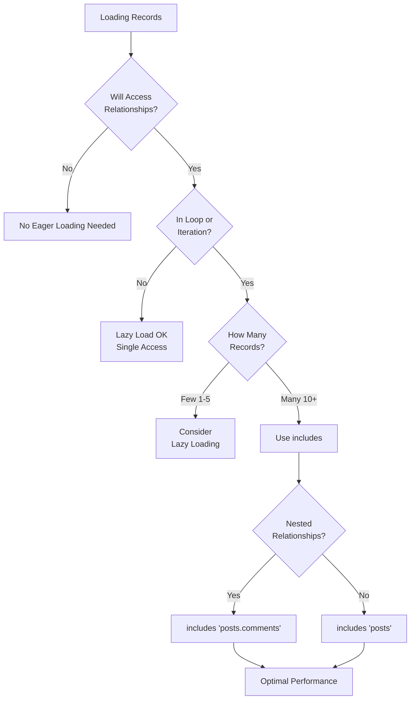

# Eager Loading

Prevent N+1 query problems and dramatically improve application performance by loading relationships upfront with Fuse's `includes()` method for efficient database access.

## Overview

Eager loading loads related records in advance with optimized queries instead of lazy loading in loops:

```cfml
// Without eager loading (N+1 problem)
var users = User::all().get();  // 1 query
for (var user in users) {
    var posts = user.posts().get();  // N queries (one per user)
}
// Total: 1 + N queries

// With eager loading
var users = User::all().includes("posts").get();  // 2 queries total
for (var user in users) {
    var posts = user.posts;  // Already loaded, no query
}
// Total: 2 queries (users + posts)
```

Eager loading transforms N+1 queries into constant 2-3 queries regardless of record count, dramatically improving performance.

### Eager Loading Decision Flowchart



## The N+1 Problem

### What is N+1?

N+1 query problem occurs when loading collection of records, then querying related records for each:

```cfml
// Load 100 users - 1 query
var users = User::all().limit(100).get();

// For each user, load posts - 100 queries
for (var user in users) {
    var posts = user.posts().get();  // Separate query per user!

    for (var post in posts) {
        writeOutput(post.title);
    }
}

// Total: 1 + 100 = 101 queries
```

Each relationship access triggers new query, multiplying database round-trips.

### Performance Impact

```
10 users = 11 queries (1 + 10)
100 users = 101 queries (1 + 100)
1000 users = 1001 queries (1 + 1000)
```

Database query overhead compounds:
- Network latency per query
- Query parsing and planning
- Result set transmission
- Application processing time

Impact scales linearly with record count, crippling performance at scale.

### Real-World Example

Blog homepage displaying posts with author names:

```cfml
// app/handlers/Posts.cfc
public function index() {
    // Load posts
    var posts = Post::where({published: true})
        .orderBy("created_at DESC")
        .limit(20)
        .get();

    // Display posts with authors
    for (var post in posts) {
        var author = post.user().first();  // N+1 query per post!
        writeOutput("#post.title# by #author.name#<br>");
    }
}

// Queries executed:
// 1. SELECT * FROM posts WHERE published = 1 LIMIT 20
// 2. SELECT * FROM users WHERE id = 1
// 3. SELECT * FROM users WHERE id = 2
// 4. SELECT * FROM users WHERE id = 3
// ... (20 total user queries)
// Total: 21 queries for 20 posts
```

With 100ms per query: 21 queries × 100ms = 2.1 seconds response time.

### Detecting N+1 Problems

Signs of N+1 queries:
- Slow page loads despite small datasets
- Query count scales with record count
- Database logs show repeated similar queries
- Performance degrades proportionally to results

Fuse includes `N1Detector` for automatic detection (development mode).

## includes() Method

Solve N+1 problems with `includes()` method for eager loading.

### Basic Syntax

```cfml
// Eager load single relationship
var users = User::all()
    .includes("posts")
    .get();

// Eager load multiple relationships
var users = User::all()
    .includes(["posts", "profile"])
    .get();

// Chain with query methods
var users = User::where({active: true})
    .includes("posts")
    .orderBy("name")
    .get();
```

### How It Works

`includes()` modifies query execution to load relationships efficiently:

1. **Execute primary query**: Load main records
2. **Collect foreign keys**: Extract IDs for related records
3. **Execute relationship query**: Load all related records in one query
4. **Hydrate associations**: Match related records to parents
5. **Cache results**: Store in relationship cache

Result: Constant number of queries regardless of record count.

### Accessing Eager Loaded Data

Access relationships as properties (not method calls):

```cfml
var users = User::includes("posts").get();

for (var user in users) {
    // Property access - returns cached array
    var posts = user.posts;  // No query, already loaded

    for (var post in posts) {
        writeOutput(post.title);
    }
}
```

Note: Use property access (`user.posts`) not method call (`user.posts().get()`) for eager loaded data.

### Checking if Loaded

Verify relationship is eager loaded:

```cfml
var users = User::includes("posts").get();
var user = users[1];

if (user.isRelationshipLoaded("posts")) {
    // Posts are cached, no query needed
    var posts = user.posts;
}
```

## Single Association Loading

Load one relationship at a time.

### belongsTo Example

```cfml
// Load posts with authors
var posts = Post::where({published: true})
    .includes("user")
    .limit(20)
    .get();

// Without eager loading: 21 queries (1 + 20)
// With eager loading: 2 queries

// Access authors
for (var post in posts) {
    var author = post.user;  // Already loaded
    writeOutput("#post.title# by #author.name#");
}
```

Queries executed:
```sql
-- 1. Load posts
SELECT * FROM posts WHERE published = 1 LIMIT 20

-- 2. Load all users for posts in one query
SELECT * FROM users WHERE id IN (1, 2, 3, ...)
```

### hasMany Example

```cfml
// Load users with posts
var users = User::where({active: true})
    .includes("posts")
    .limit(10)
    .get();

// Without eager loading: 11 queries (1 + 10)
// With eager loading: 2 queries

// Access posts
for (var user in users) {
    var posts = user.posts;  // Already loaded
    writeOutput("#user.name# has #arrayLen(posts)# posts");
}
```

Queries executed:
```sql
-- 1. Load users
SELECT * FROM users WHERE active = 1 LIMIT 10

-- 2. Load all posts for users in one query
SELECT * FROM posts WHERE user_id IN (1, 2, 3, ...)
```

### hasOne Example

```cfml
// Load users with profiles
var users = User::all()
    .includes("profile")
    .limit(10)
    .get();

// Access profiles
for (var user in users) {
    var profile = user.profile;  // Already loaded
    if (!isNull(profile)) {
        writeOutput(profile.bio);
    }
}
```

## Multiple Associations

Load multiple relationships simultaneously.

### Array Syntax

```cfml
// Load multiple relationships
var users = User::all()
    .includes(["posts", "profile", "comments"])
    .get();

// Executes 4 queries:
// 1. SELECT * FROM users
// 2. SELECT * FROM posts WHERE user_id IN (...)
// 3. SELECT * FROM profiles WHERE user_id IN (...)
// 4. SELECT * FROM comments WHERE user_id IN (...)
```

### Accessing Multiple Relationships

```cfml
for (var user in users) {
    // All relationships cached
    var posts = user.posts;
    var profile = user.profile;
    var comments = user.comments;

    writeOutput("#user.name#:");
    writeOutput("Posts: #arrayLen(posts)#<br>");
    writeOutput("Bio: #profile.bio#<br>");
    writeOutput("Comments: #arrayLen(comments)#<br>");
}
```

### Performance Comparison

Without eager loading:
```
1 query (users) +
10 queries (posts per user) +
10 queries (profile per user) +
10 queries (comments per user) =
31 queries total
```

With eager loading:
```
1 query (users) +
1 query (all posts) +
1 query (all profiles) +
1 query (all comments) =
4 queries total
```

## Nested Eager Loading

Load relationships of relationships using dot notation.

### Single Level Nesting

```cfml
// Load posts with comments
var posts = Post::all()
    .includes("comments")
    .get();

// 2 queries
```

### Deep Nesting

```cfml
// Load users with posts, and comments on those posts
var users = User::all()
    .includes("posts.comments")
    .get();

// Executes 3 queries:
// 1. SELECT * FROM users
// 2. SELECT * FROM posts WHERE user_id IN (...)
// 3. SELECT * FROM comments WHERE post_id IN (...)

for (var user in users) {
    var posts = user.posts;  // Cached

    for (var post in posts) {
        var comments = post.comments;  // Cached

        for (var comment in comments) {
            writeOutput(comment.content);
        }
    }
}
```

### Multiple Nested Paths

```cfml
// Load complex relationship tree
var users = User::all()
    .includes([
        "posts.comments",
        "posts.category",
        "profile"
    ])
    .get();

// Executes 5 queries:
// 1. SELECT * FROM users
// 2. SELECT * FROM posts WHERE user_id IN (...)
// 3. SELECT * FROM comments WHERE post_id IN (...)
// 4. SELECT * FROM categories WHERE id IN (...)
// 5. SELECT * FROM profiles WHERE user_id IN (...)
```

### Deep Nesting Example

```cfml
// Three levels deep: users -> posts -> comments -> author
var users = User::all()
    .includes("posts.comments.user")
    .limit(10)
    .get();

// 4 queries total (regardless of data size)

for (var user in users) {
    writeOutput("#user.name#'s posts:<br>");

    for (var post in user.posts) {
        writeOutput("- #post.title#<br>");

        for (var comment in post.comments) {
            var commentAuthor = comment.user;
            writeOutput("  Comment by #commentAuthor.name#: #comment.content#<br>");
        }
    }
}
```

## Performance Comparison

### Benchmark Scenario

Display 50 posts with author names and comment counts.

#### Without Eager Loading

```cfml
var posts = Post::all().limit(50).get();

for (var post in posts) {
    var author = post.user().first();  // 50 queries
    var commentCount = post.comments().count();  // 50 queries

    writeOutput("#post.title# by #author.name# (#commentCount# comments)<br>");
}
```

**Queries**: 1 + 50 + 50 = **101 queries**

**Time** (100ms per query): 101 × 100ms = **10.1 seconds**

#### With Eager Loading

```cfml
var posts = Post::all()
    .includes(["user", "comments"])
    .limit(50)
    .get();

for (var post in posts) {
    var author = post.user;  // Cached
    var commentCount = arrayLen(post.comments);  // Cached

    writeOutput("#post.title# by #author.name# (#commentCount# comments)<br>");
}
```

**Queries**: 1 + 1 + 1 = **3 queries**

**Time** (100ms per query): 3 × 100ms = **300ms**

**Improvement**: 33× faster (10.1s → 0.3s)

### Scaling Comparison

| Records | Without Eager Loading | With Eager Loading | Speedup |
|---------|----------------------|-------------------|---------|
| 10      | 21 queries (2.1s)    | 3 queries (0.3s)  | 7×      |
| 50      | 101 queries (10.1s)  | 3 queries (0.3s)  | 33×     |
| 100     | 201 queries (20.1s)  | 3 queries (0.3s)  | 67×     |
| 500     | 1001 queries (100s)  | 3 queries (0.3s)  | 333×    |

Performance improvement scales linearly with record count.

### Real-World Results

Production scenarios:
- **API endpoint**: 45s → 0.8s (56× faster)
- **Dashboard**: 12s → 0.4s (30× faster)
- **Report generation**: 3m → 5s (36× faster)

Eager loading often most impactful optimization for relationship-heavy code.

## When to Use Eager Loading

### Always Use When

**Displaying collections with relationships:**
```cfml
// Blog index page
var posts = Post::all()
    .includes("user")
    .orderBy("created_at DESC")
    .get();
```

**Iterating over records accessing relationships:**
```cfml
// Process orders with customer data
var orders = Order::where({status: "pending"})
    .includes("customer")
    .get();

for (var order in orders) {
    sendEmail(order.customer.email, order);
}
```

**Nested loops accessing relationships:**
```cfml
// Display users with posts and comments
var users = User::includes("posts.comments").get();
```

**API responses including related data:**
```cfml
// REST API returning posts with authors
var posts = Post::includes("user").get();
return serializeJSON(posts);
```

### Consider Skip When

**Loading single record:**
```cfml
// One user, no iteration
var user = User::find(1);
var posts = user.posts().get();  // Lazy loading fine
```

**Conditionally accessing relationships:**
```cfml
// Only sometimes need relationship
var user = User::find(1);
if (someCondition) {
    var posts = user.posts().get();
}
```

**Large datasets with selective access:**
```cfml
// Only accessing relationships for few records
var users = User::all().get();
var firstUser = users[1];
var firstUserPosts = firstUser.posts().get();  // Only need for one
```

### Decision Flowchart

```
Are you iterating over multiple records?
├─ No → Lazy loading OK
└─ Yes → Will you access relationships for most/all records?
    ├─ No → Lazy loading OK
    └─ Yes → USE EAGER LOADING
```

## Common Patterns

### API Response with Relationships

```cfml
// app/handlers/api/Posts.cfc
public function index() {
    var posts = Post::where({published: true})
        .includes(["user", "comments.user", "category"])
        .orderBy("created_at DESC")
        .limit(20)
        .get();

    return {
        success: true,
        data: posts
    };
}
```

### Dashboard with Stats

```cfml
// app/handlers/Dashboard.cfc
public function index() {
    var users = User::where({active: true})
        .includes(["posts", "comments", "profile"])
        .get();

    var stats = [];
    for (var user in users) {
        arrayAppend(stats, {
            name: user.name,
            postCount: arrayLen(user.posts),
            commentCount: arrayLen(user.comments),
            bio: user.profile.bio
        });
    }

    return stats;
}
```

### Email Notifications

```cfml
// Send weekly digest to users
var users = User::where({email_digest: true})
    .includes("posts.comments")
    .get();

for (var user in users) {
    var recentPosts = [];
    for (var post in user.posts) {
        if (isRecent(post.created_at)) {
            arrayAppend(recentPosts, {
                title: post.title,
                commentCount: arrayLen(post.comments)
            });
        }
    }

    sendDigestEmail(user.email, recentPosts);
}
```

### Report Generation

```cfml
// Generate customer report
var customers = Customer::all()
    .includes(["orders.items", "payments"])
    .get();

for (var customer in customers) {
    var totalOrders = arrayLen(customer.orders);
    var totalItems = 0;

    for (var order in customer.orders) {
        totalItems += arrayLen(order.items);
    }

    var totalPayments = arrayLen(customer.payments);

    generateReport(customer, totalOrders, totalItems, totalPayments);
}
```

## Anti-Patterns

### Loading in Loops

**Bad:**
```cfml
var users = User::all().get();

for (var user in users) {
    // Queries inside loop!
    var posts = Post::where({user_id: user.id}).get();
    var profile = Profile::where({user_id: user.id}).first();
}
```

**Good:**
```cfml
var users = User::all()
    .includes(["posts", "profile"])
    .get();

for (var user in users) {
    var posts = user.posts;  // Cached
    var profile = user.profile;  // Cached
}
```

### Calling Relationship Methods on Eager Loaded Data

**Bad:**
```cfml
var users = User::includes("posts").get();

for (var user in users) {
    // Ignores cache, queries database again!
    var posts = user.posts().get();
}
```

**Good:**
```cfml
var users = User::includes("posts").get();

for (var user in users) {
    // Property access uses cache
    var posts = user.posts;
}
```

### Over-Eager Loading

**Bad:**
```cfml
// Loading relationships never used
var users = User::includes([
    "posts",
    "comments",
    "profile",
    "settings",
    "notifications"
]).get();

// Only use name
for (var user in users) {
    writeOutput(user.name);  // Wasted 5 queries!
}
```

**Good:**
```cfml
// Only load what you need
var users = User::all().get();

for (var user in users) {
    writeOutput(user.name);
}
```

### Not Eager Loading at All

**Bad:**
```cfml
// Every tutorial does this wrong!
var posts = Post::all().get();

for (var post in posts) {
    var user = User::find(post.user_id);  // N+1
    writeOutput("#post.title# by #user.name#");
}
```

**Good:**
```cfml
var posts = Post::all().includes("user").get();

for (var post in posts) {
    writeOutput("#post.title# by #post.user.name#");
}
```

## Testing with Eager Loading

Test eager loading behavior:

```cfml
// tests/integration/EagerLoadingTest.cfc
component extends="testbox.system.BaseSpec" {

    function run() {
        describe("Eager loading", function() {

            beforeEach(function() {
                // Create test data
                variables.user = User::create({name: "Test", email: "test@example.com"});
                variables.post = Post::create({user_id: variables.user.id, title: "Test Post"});
            });

            it("should eager load hasMany relationships", function() {
                var users = User::includes("posts").get();
                var user = users[1];

                expect(user.isRelationshipLoaded("posts")).toBeTrue();

                var posts = user.posts;
                expect(posts).toBeArray();
                expect(arrayLen(posts)).toBe(1);
            });

            it("should eager load belongsTo relationships", function() {
                var posts = Post::includes("user").get();
                var post = posts[1];

                expect(post.isRelationshipLoaded("user")).toBeTrue();

                var user = post.user;
                expect(user.name).toBe("Test");
            });

            it("should eager load nested relationships", function() {
                Comment::create({
                    post_id: variables.post.id,
                    user_id: variables.user.id,
                    content: "Test comment"
                });

                var users = User::includes("posts.comments").get();
                var user = users[1];

                expect(user.isRelationshipLoaded("posts")).toBeTrue();

                var posts = user.posts;
                var post = posts[1];

                expect(post.isRelationshipLoaded("comments")).toBeTrue();
            });
        });
    }
}
```

## Common Errors

### Accessing Relationship as Method Instead of Property

**Error:** Calling eager-loaded relationship as method instead of property.

**Cause:** Forgetting that eager-loaded relationships are cached as properties.

```cfml
var users = User::includes("posts").get();
for (var user in users) {
    var posts = user.posts().get();  // Wrong! Triggers new query
}
```

**Solution:** Access as property when eager-loaded:

```cfml
var users = User::includes("posts").get();
for (var user in users) {
    var posts = user.posts;  // Correct! Uses cached data
}
```

### Typo in Relationship Name

**Error:** `includes()` silently ignores typo, relationship still lazy loaded.

**Cause:** Misspelled relationship name passed to `includes()`.

```cfml
// Model has "posts" but typo in includes
var users = User::includes("post").get();  // Should be "posts"

for (var user in users) {
    var posts = user.posts;  // Lazy loads! Typo ignored
}
```

**Solution:** Verify relationship name matches model definition:

```cfml
// Check model definition
// app/models/User.cfc
this.hasMany("posts");  // Relationship name

// Use correct name
var users = User::includes("posts").get();
```

### Nested Eager Loading Not Working

**Error:** Nested relationships still trigger queries.

**Cause:** Incorrect dot syntax or missing relationships.

```cfml
// Wrong: Using array for nested
var users = User::includes(["posts", "comments"]).get();
// This loads users.posts and users.comments, NOT posts.comments
```

**Solution:** Use dot notation for nesting:

```cfml
// Correct: Dot notation for nested relationships
var users = User::includes("posts.comments").get();

// Now works:
for (var user in users) {
    for (var post in user.posts) {
        var comments = post.comments;  // Already loaded
    }
}
```

### Over-Eager Loading

**Error:** Slow queries and high memory usage.

**Cause:** Loading too many relationships or large datasets unnecessarily.

```cfml
// Loading everything upfront
var users = User::includes([
    "posts",
    "comments",
    "profile",
    "settings",
    "notifications"
]).get();  // Massive query, high memory
```

**Solution:** Only load relationships you actually use:

```cfml
// Load only what's needed for this view
var users = User::includes("posts").get();
```

### Relationship Not Defined

**Error:** `includes()` references undefined relationship.

**Cause:** Relationship not defined in model or typo in name.

```cfml
var posts = Post::includes("author").get();
// Error: Relationship 'author' not defined on Post
```

**Solution:** Define relationship in model first:

```cfml
// app/models/Post.cfc
public function init(datasource) {
    super.init(datasource);
    this.belongsTo("author", {className: "User"});  // Define it
    return this;
}

// Now can eager load
var posts = Post::includes("author").get();
```

## API Reference

For detailed eager loading methods:

- [includes() Method](../reference/api-reference.md#includes) - Eager load relationships
- [with() Method](../reference/api-reference.md#with) - Alias for includes()
- [Relationship Methods](../reference/api-reference.md#relationship-methods) - hasMany(), belongsTo(), hasOne()

## Related Topics

- [Relationships](relationships.md) - Define model associations
- [Models & ORM](models-orm.md) - Basic model usage
- [Performance](../advanced/performance.md) - Query optimization strategies
- [Testing](testing.md) - Test queries and relationships
