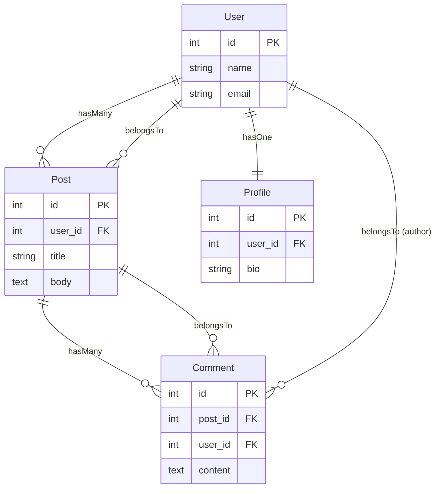

# Relationships

Fuse ORM provides intuitive relationship definitions using `hasMany`, `hasOne`, and `belongsTo` to express associations between models with automatic foreign key conventions and query methods.

## Overview

Define relationships in model `init()` methods to establish associations:

### Relationship Types Diagram



### Basic Usage

```cfml
// app/models/User.cfc
component extends="fuse.orm.ActiveRecord" {

    public function init(datasource) {
        super.init(datasource);

        // Define relationships
        this.hasMany("posts");
        this.hasOne("profile");

        return this;
    }
}
```

```cfml
// app/models/Post.cfc
component extends="fuse.orm.ActiveRecord" {

    public function init(datasource) {
        super.init(datasource);

        // Inverse relationship
        this.belongsTo("user");
        this.hasMany("comments");

        return this;
    }
}
```

Access related records through relationship methods:

```cfml
var user = User::find(1);

// Get all posts
var posts = user.posts().get();

// Chain query methods
var publishedPosts = user.posts()
    .where({published: true})
    .orderBy("created_at DESC")
    .get();

// Get single profile
var profile = user.profile().first();
```

Relationships reduce boilerplate, enforce consistency, and enable eager loading to prevent N+1 queries.

## belongsTo Relationship

Use `belongsTo` when model contains foreign key to another table.

### Definition

```cfml
// app/models/Post.cfc
component extends="fuse.orm.ActiveRecord" {

    public function init(datasource) {
        super.init(datasource);

        // Post belongs to User
        this.belongsTo("user");

        return this;
    }
}
```

Convention:
- **Foreign key**: `user_id` (relationship name + `_id`)
- **Related model**: `User` (capitalized relationship name)
- **Related table**: `users` (pluralized model name)

### Database Schema

```sql
CREATE TABLE posts (
    id INT PRIMARY KEY,
    user_id INT,  -- Foreign key
    title VARCHAR(255),
    body TEXT
);

CREATE TABLE users (
    id INT PRIMARY KEY,
    name VARCHAR(255),
    email VARCHAR(255)
);
```

### Usage

```cfml
// Get parent record
var post = Post::find(1);
var author = post.user().first();

// Access attributes
writeOutput(author.name);

// Chain conditions
var activeAuthor = post.user()
    .where({active: true})
    .first();
```

### Custom Options

Override conventions with options:

```cfml
// Custom foreign key
this.belongsTo("author", {
    foreignKey: "created_by_id",
    className: "User"
});

// Custom class name
this.belongsTo("team", {
    className: "Organization"
});
```

Options:
- **foreignKey**: Override foreign key column (default: `{name}_id`)
- **className**: Override related model class (default: capitalized `name`)

### Common Patterns

```cfml
// Check if parent exists
var post = Post::find(1);
var user = post.user().first();
if (!isNull(user)) {
    writeOutput(user.name);
}

// Access foreign key directly
var userId = post.user_id;
var user = User::find(userId);

// Query through relationship
var posts = Post::where({})
    .includes("user")  // Eager load
    .get();
```

## hasMany Relationship

Use `hasMany` when model has multiple related records in another table.

### Definition

```cfml
// app/models/User.cfc
component extends="fuse.orm.ActiveRecord" {

    public function init(datasource) {
        super.init(datasource);

        // User has many Posts
        this.hasMany("posts");

        return this;
    }
}
```

Convention:
- **Foreign key**: `user_id` in posts table (singular parent table + `_id`)
- **Related model**: `Post` (singularized, capitalized relationship name)
- **Related table**: `posts` (relationship name)

### Database Schema

```sql
CREATE TABLE users (
    id INT PRIMARY KEY,
    name VARCHAR(255)
);

CREATE TABLE posts (
    id INT PRIMARY KEY,
    user_id INT,  -- Foreign key points back to users
    title VARCHAR(255)
);
```

### Usage

```cfml
var user = User::find(1);

// Get all related records
var posts = user.posts().get();
// Returns array of Post instances

// Chain query methods
var publishedPosts = user.posts()
    .where({published: true})
    .orderBy("created_at DESC")
    .limit(10)
    .get();

// Count related records
var postCount = user.posts().count();

// Get first record
var latestPost = user.posts()
    .orderBy("created_at DESC")
    .first();
```

### Custom Options

```cfml
// Custom foreign key
this.hasMany("articles", {
    foreignKey: "author_id",
    className: "BlogPost"
});

// Custom class name
this.hasMany("memberships", {
    className: "TeamMember"
});
```

### Common Patterns

```cfml
// Check if any records exist
var user = User::find(1);
var hasPost = user.posts().count() > 0;

// Conditional queries
var recentPosts = user.posts()
    .where({created_at: {gte: dateAdd("d", -7, now())}})
    .get();

// Complex chaining
var popularPosts = user.posts()
    .where({published: true})
    .where({view_count: {gte: 100}})
    .orderBy("view_count DESC")
    .limit(5)
    .get();
```

## hasOne Relationship

Use `hasOne` when model has single related record in another table.

### Definition

```cfml
// app/models/User.cfc
component extends="fuse.orm.ActiveRecord" {

    public function init(datasource) {
        super.init(datasource);

        // User has one Profile
        this.hasOne("profile");

        return this;
    }
}
```

Convention:
- **Foreign key**: `user_id` in profiles table (singular parent table + `_id`)
- **Related model**: `Profile` (capitalized relationship name)
- **Related table**: `profiles` (pluralized relationship name)

### Database Schema

```sql
CREATE TABLE users (
    id INT PRIMARY KEY,
    name VARCHAR(255)
);

CREATE TABLE profiles (
    id INT PRIMARY KEY,
    user_id INT UNIQUE,  -- Foreign key with unique constraint
    bio TEXT,
    avatar_url VARCHAR(255)
);
```

Note: Add `UNIQUE` constraint on foreign key to enforce one-to-one relationship at database level.

### Usage

```cfml
var user = User::find(1);

// Get related record
var profile = user.profile().first();

// Access attributes
if (!isNull(profile)) {
    writeOutput(profile.bio);
}

// Chain conditions
var profile = user.profile()
    .where({verified: true})
    .first();
```

### Custom Options

```cfml
// Custom foreign key
this.hasOne("settings", {
    foreignKey: "owner_id",
    className: "UserSettings"
});

// Custom class name
this.hasOne("account", {
    className: "BillingAccount"
});
```

### Common Patterns

```cfml
// Create related record
var user = User::find(1);
var profile = new Profile(datasource);
profile.user_id = user.id;
profile.bio = "Software developer";
profile.save();

// Check existence
var hasProfile = !isNull(user.profile().first());

// Conditional access
var profile = user.profile().first();
var bio = isNull(profile) ? "No bio" : profile.bio;
```

## Through Relationships

Define relationships through intermediate models (has-many-through pattern).

### Concept

Access related records through another relationship:

```
User -> Posts -> Comments
```

User has many Comments through Posts.

### Definition

Currently implemented via chained relationships:

```cfml
// app/models/User.cfc
component extends="fuse.orm.ActiveRecord" {

    public function init(datasource) {
        super.init(datasource);

        this.hasMany("posts");
        // Comments accessed via posts

        return this;
    }
}

// app/models/Post.cfc
component extends="fuse.orm.ActiveRecord" {

    public function init(datasource) {
        super.init(datasource);

        this.belongsTo("user");
        this.hasMany("comments");

        return this;
    }
}

// app/models/Comment.cfc
component extends="fuse.orm.ActiveRecord" {

    public function init(datasource) {
        super.init(datasource);

        this.belongsTo("post");
        this.belongsTo("user");  // Direct relationship

        return this;
    }
}
```

### Usage

```cfml
// Access through relationships
var user = User::find(1);
var posts = user.posts().includes("comments").get();

for (var post in posts) {
    var comments = post.comments;
    // Process comments
}

// Or query directly with join
var comments = Comment::where({user_id: user.id}).get();
```

### Database Schema

```sql
CREATE TABLE users (
    id INT PRIMARY KEY,
    name VARCHAR(255)
);

CREATE TABLE posts (
    id INT PRIMARY KEY,
    user_id INT,
    title VARCHAR(255)
);

CREATE TABLE comments (
    id INT PRIMARY KEY,
    post_id INT,    -- Through relationship
    user_id INT,    -- Direct relationship
    content TEXT
);
```

## Foreign Key Conventions

Fuse uses consistent foreign key naming conventions.

### Default Pattern

Foreign key format: `{singular_table_name}_id`

| Parent Table | Foreign Key Column | Related Model |
|--------------|-------------------|---------------|
| users | user_id | User |
| posts | post_id | Post |
| blog_posts | blog_post_id | BlogPost |
| categories | category_id | Category |

### Examples

```cfml
// posts table has user_id
// Post belongsTo User
this.belongsTo("user");  // Uses user_id

// comments table has post_id
// Comment belongsTo Post
this.belongsTo("post");  // Uses post_id

// posts table has category_id
// Post belongsTo Category
this.belongsTo("category");  // Uses category_id
```

### Overriding Conventions

```cfml
// Custom foreign key
this.belongsTo("author", {
    foreignKey: "created_by_id",
    className: "User"
});

// Legacy database
this.hasMany("orders", {
    foreignKey: "customer_id"
});
```

### Composite Keys

For tables with composite primary keys, specify foreign key explicitly:

```cfml
this.belongsTo("account", {
    foreignKey: "account_code"  // Non-standard key
});
```

## Relationship Methods

Access relationships through dynamic methods generated from definitions.

### Method Naming

Relationship method name matches relationship name:

```cfml
this.hasMany("posts");
// Creates posts() method

this.belongsTo("user");
// Creates user() method

this.hasOne("profile");
// Creates profile() method
```

### Query Builder Return

Relationship methods return QueryBuilder for chaining:

```cfml
var user = User::find(1);

// Returns QueryBuilder
var query = user.posts();

// Chain query methods
query.where({published: true})
     .orderBy("created_at DESC")
     .limit(10);

// Execute query
var results = query.get();
```

### Available Methods

All QueryBuilder methods available on relationships:

```cfml
// Filtering
user.posts().where({status: "published"}).get();

// Ordering
user.posts().orderBy("created_at DESC").get();

// Limiting
user.posts().limit(10).offset(20).get();

// Counting
user.posts().count();

// First record
user.posts().first();

// Specific columns
user.posts().select("id, title").get();

// Complex conditions
user.posts()
    .where({published: true})
    .where({view_count: {gte: 100}})
    .orderBy("view_count DESC")
    .get();
```

### Caching Results

Relationship results cached after eager loading:

```cfml
// Eager load with includes()
var users = User::includes("posts").get();

var user = users[1];

// First access - returns cached array
var posts1 = user.posts;

// Second access - same cached reference (no query)
var posts2 = user.posts;
```

See [Eager Loading](eager-loading.md) for caching details.

## Inverse Relationships

Define bidirectional relationships for navigating both directions.

### Example Setup

```cfml
// app/models/User.cfc
component extends="fuse.orm.ActiveRecord" {

    public function init(datasource) {
        super.init(datasource);

        this.hasMany("posts");
        this.hasMany("comments");

        return this;
    }
}

// app/models/Post.cfc
component extends="fuse.orm.ActiveRecord" {

    public function init(datasource) {
        super.init(datasource);

        this.belongsTo("user");  // Inverse of User.hasMany("posts")
        this.hasMany("comments");

        return this;
    }
}

// app/models/Comment.cfc
component extends="fuse.orm.ActiveRecord" {

    public function init(datasource) {
        super.init(datasource);

        this.belongsTo("post");  // Inverse of Post.hasMany("comments")
        this.belongsTo("user");  // Inverse of User.hasMany("comments")

        return this;
    }
}
```

### Navigation

```cfml
// Top-down navigation
var user = User::find(1);
var posts = user.posts().get();
var firstPost = posts[1];
var comments = firstPost.comments().get();

// Bottom-up navigation
var comment = Comment::find(1);
var post = comment.post().first();
var author = post.user().first();
```

### Benefits

- **Bidirectional access**: Navigate relationships in both directions
- **Data consistency**: Same foreign key enforces relationship
- **Query flexibility**: Choose optimal query direction

## Example: Complete Relationship Setup

Blog application with users, posts, and comments:

```cfml
// app/models/User.cfc
component extends="fuse.orm.ActiveRecord" {

    public function init(datasource) {
        super.init(datasource);

        // User has many posts
        this.hasMany("posts");

        // User has many comments
        this.hasMany("comments");

        // User has one profile
        this.hasOne("profile");

        return this;
    }
}

// app/models/Post.cfc
component extends="fuse.orm.ActiveRecord" {

    public function init(datasource) {
        super.init(datasource);

        // Post belongs to User
        this.belongsTo("user");

        // Post has many comments
        this.hasMany("comments");

        // Post belongs to Category
        this.belongsTo("category");

        return this;
    }
}

// app/models/Comment.cfc
component extends="fuse.orm.ActiveRecord" {

    public function init(datasource) {
        super.init(datasource);

        // Comment belongs to Post
        this.belongsTo("post");

        // Comment belongs to User (author)
        this.belongsTo("user");

        return this;
    }
}

// app/models/Profile.cfc
component extends="fuse.orm.ActiveRecord" {

    public function init(datasource) {
        super.init(datasource);

        // Profile belongs to User
        this.belongsTo("user");

        return this;
    }
}

// app/models/Category.cfc
component extends="fuse.orm.ActiveRecord" {

    public function init(datasource) {
        super.init(datasource);

        // Category has many posts
        this.hasMany("posts");

        return this;
    }
}
```

Usage examples:

```cfml
// Get user's posts
var user = User::find(1);
var posts = user.posts().where({published: true}).get();

// Get post's author and comments
var post = Post::find(1);
var author = post.user().first();
var comments = post.comments().orderBy("created_at DESC").get();

// Get comment's post and author
var comment = Comment::find(1);
var post = comment.post().first();
var author = comment.user().first();

// Get user's profile
var profile = user.profile().first();

// Get category's posts
var category = Category::find(1);
var posts = category.posts().get();
```

## Anti-Patterns

### Manual Foreign Key Queries

**Bad:**
```cfml
// Manual query with foreign key
var post = Post::find(1);
var userId = post.user_id;
var user = User::find(userId);
```

**Good:**
```cfml
// Use relationship
var post = Post::find(1);
var user = post.user().first();
```

Relationships provide consistency, eager loading support, and cleaner code.

### N+1 Queries

**Bad:**
```cfml
// Load users
var users = User::all().get();

// Then query posts for each user (N+1 problem)
for (var user in users) {
    var posts = user.posts().get();  // Separate query per user!
    // Process posts
}
```

**Good:**
```cfml
// Eager load posts with users
var users = User::all().includes("posts").get();

for (var user in users) {
    var posts = user.posts;  // Already loaded, no query
    // Process posts
}
```

See [Eager Loading](eager-loading.md) guide.

### Missing Inverse Relationships

**Bad:**
```cfml
// Only define one direction
// app/models/User.cfc
this.hasMany("posts");

// app/models/Post.cfc
// No belongsTo defined!
```

**Good:**
```cfml
// Define both directions
// app/models/User.cfc
this.hasMany("posts");

// app/models/Post.cfc
this.belongsTo("user");
```

Inverse relationships enable bidirectional navigation and data consistency.

### Incorrect Relationship Types

**Bad:**
```cfml
// User should have many posts, not one
this.hasOne("posts");  // Wrong!
```

**Good:**
```cfml
// Use correct type
this.hasMany("posts");
```

Choose relationship type based on cardinality:
- One-to-many: `hasMany` / `belongsTo`
- One-to-one: `hasOne` / `belongsTo`

### Forgetting Foreign Keys

**Bad:**
```sql
-- Missing foreign key column
CREATE TABLE posts (
    id INT PRIMARY KEY,
    title VARCHAR(255)
    -- Missing user_id!
);
```

**Good:**
```sql
-- Include foreign key
CREATE TABLE posts (
    id INT PRIMARY KEY,
    user_id INT,  -- Foreign key
    title VARCHAR(255)
);
```

Ensure database schema matches relationship definitions.

## Testing Relationships

Test relationship queries in unit and integration tests:

```cfml
// tests/models/PostRelationshipsTest.cfc
component extends="fuse.testing.TestCase" {

    public function setup() {
        // Create test data
        variables.user = User::create({
            name: "Test User",
            email: "test@example.com"
        });

        variables.post = Post::create({
            user_id: variables.user.id,
            title: "Test Post",
            body: "Content"
        });

        Comment::create({
            post_id: variables.post.id,
            user_id: variables.user.id,
            content: "Comment 1"
        });

        Comment::create({
            post_id: variables.post.id,
            user_id: variables.user.id,
            content: "Comment 2"
        });
    }

    public function testPostBelongsToUser() {
        var author = variables.post.user().first();

        assertNotNull(author);
        assertEqual(variables.user.id, author.id);
        assertEqual("Test User", author.name);
    }

    public function testPostHasComments() {
        var comments = variables.post.comments().get();

        assertCount(2, comments);
        assertInstanceOf("array", comments);
    }

    public function testUserHasPosts() {
        var posts = variables.user.posts().get();

        assertCount(1, posts);
        assertEqual("Test Post", posts[1].title);
    }

    public function testCommentBelongsToPost() {
        var comment = Comment::where({content: "Comment 1"}).first();
        var post = comment.post().first();

        assertEqual(variables.post.id, post.id);
    }

    public function testChainQueryMethodsOnRelationship() {
        var comments = variables.post.comments()
            .where({content: "Comment 1"})
            .get();

        assertCount(1, comments);
        assertEqual("Comment 1", comments[1].content);
    }

    public function testCountRelatedRecords() {
        var count = variables.user.posts().count();
        assertEqual(1, count);

        var commentCount = variables.post.comments().count();
        assertEqual(2, commentCount);
    }
}
```

See [Testing](testing.md) guide for more patterns.

## Common Errors

### Foreign Key Column Missing

**Error:** Relationship query fails with column not found error.

**Cause:** Database table missing expected foreign key column.

```cfml
// Model defines relationship
this.belongsTo("user");

// But posts table missing user_id column
// Error: Column user_id not found
```

**Solution:** Add foreign key column via migration:

```cfml
// Migration
table.integer("user_id").index();
```

Convention: Foreign key is `{relationship_name}_id`.

### Relationship Method Returns Null

**Error:** Calling relationship method returns null unexpectedly.

**Cause:** Relationship not defined in model or typo in relationship name.

```cfml
var user = User::find(1);
var posts = user.posts();  // Returns null
```

**Solution:** Ensure relationship defined correctly:

```cfml
// app/models/User.cfc
public function init(datasource) {
    super.init(datasource);
    this.hasMany("posts");  // Must be defined
    return this;
}
```

### Wrong Relationship Type

**Error:** Relationship returns unexpected results (single vs multiple records).

**Cause:** Using `hasOne` when should use `hasMany` or vice versa.

```cfml
// Wrong: User has ONE post
this.hasOne("posts");

var user = User::find(1);
var posts = user.posts().first();  // Returns single post, not array
```

**Solution:** Use correct relationship type:

```cfml
// Correct: User has MANY posts
this.hasMany("posts");

var user = User::find(1);
var posts = user.posts().get();  // Returns array
```

### Custom Foreign Key Not Working

**Error:** Relationship uses wrong foreign key even when specified.

**Cause:** Typo in options or incorrect syntax.

```cfml
// Wrong key name
this.belongsTo("author", {
    foreign_key: "created_by_id"  // Should be foreignKey
});
```

**Solution:** Use correct option name:

```cfml
this.belongsTo("author", {
    foreignKey: "created_by_id",  // Correct
    className: "User"
});
```

### Inverse Relationship Missing

**Error:** Can navigate one direction but not the other.

**Cause:** Only defined relationship on one model.

```cfml
// User has posts
this.hasMany("posts");

// But Post missing belongsTo("user")
var post = Post::find(1);
var user = post.user();  // Error: relationship not defined
```

**Solution:** Define both sides of relationship:

```cfml
// app/models/User.cfc
this.hasMany("posts");

// app/models/Post.cfc
this.belongsTo("user");
```

## API Reference

For detailed relationship method signatures:

- [Relationship Methods](../reference/api-reference.md#relationship-methods) - hasMany(), belongsTo(), hasOne()
- [Eager Loading](../reference/api-reference.md#eager-loading) - includes(), with()
- [Query Builder](../reference/api-reference.md#querybuilder) - Chain methods on relationships

## Related Topics

- [Models & ORM](models-orm.md) - Model basics and conventions
- [Eager Loading](eager-loading.md) - Optimize relationship queries
- [Migrations](migrations.md) - Create foreign key columns
- [Testing](testing.md) - Test relationship logic
