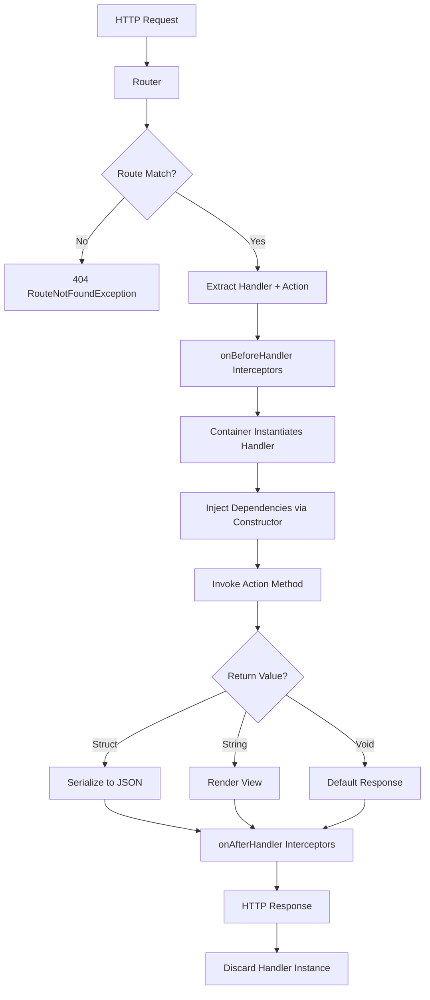

# Handler Conventions

Handlers are the controllers in Fuse's MVC architecture. They receive requests from the router, process business logic, and return responses.

## Overview

Handlers bridge routing and application logic:
1. Router matches request to handler action
2. Container instantiates handler with dependencies
3. Handler action executes business logic
4. Handler returns response (struct, string, or void)
5. Framework renders response

Handlers are transient (new instance per request) and support dependency injection.

## Handler Location

Handlers are located in `/app/handlers/` directory:

```
/app/handlers/
  Users.cfc
  Posts.cfc
  Comments.cfc
  Admin.cfc
  Pages.cfc
```

File names must match handler names referenced in routes (case-sensitive on Unix systems).

## Handler Structure

Handlers are CFCs with public action methods:

```cfml
// app/handlers/Users.cfc
component {

    public function init() {
        return this;
    }

    // Action methods receive route params as arguments
    public struct function index() {
        return {users: []};
    }

    public struct function show(required string id) {
        return {user: {id: arguments.id}};
    }

}
```

Action method names must match route action definitions.

## Handler Lifecycle

### Transient Instantiation

Handlers are **transient** - a fresh instance is created for each request. This ensures:
- Clean state per request
- No memory leaks from accumulated state
- Thread-safe request handling
- No shared variables between requests

```cfml
// Framework creates new instance per request
container.bind("Users", function(c) {
    return new app.handlers.Users();
});
```

Never store request-specific data in `variables` scope expecting it to persist across requests.

### Request Flow

Complete request lifecycle through handler:



Key phases:
1. **Route Matched** - Router identifies handler and action
2. **Handler Instantiated** - Container creates handler instance
3. **Dependencies Injected** - Constructor receives dependencies
4. **Interceptors Fire** - `onBeforeHandler` interceptors execute
5. **Action Invoked** - Handler action method executes
6. **Interceptors Fire** - `onAfterHandler` interceptors execute
7. **Response Rendered** - Return value converted to response
8. **Handler Discarded** - Instance garbage collected

### Constructor Dependency Injection

Handlers support constructor-based dependency injection via the DI Container:

```cfml
// app/handlers/Users.cfc
component {

    public function init(required logger, required userService) {
        variables.logger = arguments.logger;
        variables.userService = arguments.userService;
        return this;
    }

    public struct function index() {
        variables.logger.info("Listing users");
        var users = variables.userService.getAll();
        return {users: users};
    }

}
```

Dependencies are automatically resolved by the Container during handler instantiation. Arguments must match registered service names in the container.

### Optional Dependencies

Use `structKeyExists` for optional dependencies:

```cfml
// app/handlers/Posts.cfc
component {

    public function init(any logger) {
        if (structKeyExists(arguments, "logger")) {
            variables.logger = arguments.logger;
        }
        return this;
    }

    public struct function index() {
        if (structKeyExists(variables, "logger")) {
            variables.logger.info("Fetching posts");
        }
        return {posts: Post::all().get()};
    }

}
```

## Action Methods

### Naming Convention

Action method names match the route action definitions:

```cfml
// config/routes.cfm
router.get("/users/:id", "Users.show");

// app/handlers/Users.cfc
public struct function show(required string id) {
    return {user: findUser(arguments.id)};
}
```

Method names are case-sensitive and must be public.

### Route Parameters

Route parameters are passed as named arguments to action methods:

```cfml
// Route: GET /posts/:post_id/comments/:id
router.get("/posts/:post_id/comments/:id", "Comments.show");

// Handler receives both params
// app/handlers/Comments.cfc
public struct function show(
    required string post_id,
    required string id
) {
    return {
        post: Post::find(arguments.post_id),
        comment: Comment::find(arguments.id)
    };
}
```

Argument names must match route parameter names exactly.

### RESTful Actions

Standard RESTful resource actions:

| Action    | HTTP Method | Route Pattern       | Purpose                  |
|-----------|-------------|---------------------|--------------------------|
| `index`   | GET         | `/resources`        | List all resources       |
| `new`     | GET         | `/resources/new`    | Show create form         |
| `create`  | POST        | `/resources`        | Create new resource      |
| `show`    | GET         | `/resources/:id`    | Show single resource     |
| `edit`    | GET         | `/resources/:id/edit` | Show edit form         |
| `update`  | PUT/PATCH   | `/resources/:id`    | Update resource          |
| `destroy` | DELETE      | `/resources/:id`    | Delete resource          |

Example handler with all CRUD actions:

```cfml
// app/handlers/Posts.cfc
component {

    public struct function index() {
        var posts = Post::all().orderBy("created_at DESC").get();
        return {
            posts: posts,
            count: arrayLen(posts)
        };
    }

    public string function new() {
        return "posts/new"; // View name
    }

    public struct function create() {
        var post = Post::create(form);
        return {
            created: true,
            post: post,
            location: this.urlFor("posts_show", {id: post.id})
        };
    }

    public struct function show(required string id) {
        var post = Post::find(arguments.id);
        return {post: post};
    }

    public string function edit(required string id) {
        return "posts/edit"; // View name
    }

    public struct function update(required string id) {
        var post = Post::find(arguments.id);
        post.update(form);
        return {
            updated: true,
            post: post
        };
    }

    public struct function destroy(required string id) {
        Post::find(arguments.id).delete();
        return {deleted: true};
    }

}
```

## Return Value Handling

Handlers can return different types based on the response needed:

### Struct Return (JSON Response)

Return a struct for JSON API responses:

```cfml
// app/handlers/Api/Users.cfc
public struct function index() {
    return {
        success: true,
        users: User::all().get(),
        meta: {
            total: User::count(),
            page: 1
        }
    };
}
```

Framework serializes struct to JSON with appropriate headers.

### String Return (View Name)

Return a string to render a specific view:

```cfml
// app/handlers/Pages.cfc
public string function about() {
    return "pages/about"; // Renders /views/pages/about.cfm
}

public string function new() {
    return "users/new"; // Renders /views/users/new.cfm
}
```

View paths are relative to `/views` directory.

### Void Return (Default View)

Return nothing to render the default view based on handler and action:

```cfml
// app/handlers/Pages.cfc
public void function about() {
    // Renders /views/pages/about.cfm
    // Based on handler name (Pages) and action (about)
}
```

Default view path follows convention: `/views/{handler_name}/{action_name}.cfm`

## Helper Access

Handlers have access to framework helpers and utilities:

### URL Generation (urlFor)

The `urlFor` helper generates URLs from named routes:

```cfml
// app/handlers/Posts.cfc
component {
    public struct function show(required string id) {
        var post = Post::find(arguments.id);

        return {
            post: post,
            editUrl: this.urlFor("posts_edit", {id: arguments.id}),
            indexUrl: this.urlFor("posts_index"),
            authorUrl: this.urlFor("users_show", {id: post.user_id})
        };
    }
}
```

Helper injection is handled via interceptors during the request lifecycle.

### Request Scope

Handlers have access to the standard CFML request scope containing:
- `request.urlFor()` - URL generation helper
- `request.params` - Route parameters
- `request.event` - Event context struct

### Form and URL Data

Standard CFML scopes are available:
- `form` - POST form data
- `url` - GET query parameters
- `cgi` - CGI variables
- `request` - Request-scoped data

## Common Patterns

### Service Layer Integration

Delegate business logic to service objects:

```cfml
// app/handlers/Users.cfc
component {

    public function init(required userService) {
        variables.userService = arguments.userService;
        return this;
    }

    public struct function create() {
        try {
            var user = variables.userService.createUser(form);
            return {
                created: true,
                user: user,
                location: this.urlFor("users_show", {id: user.id})
            };
        } catch (ValidationException e) {
            return {
                success: false,
                errors: e.getErrors(),
                status: 422
            };
        }
    }

}
```

Keep handlers thin - they orchestrate, services implement.

### Model Queries

Query models directly for simple cases:

```cfml
// app/handlers/Posts.cfc
component {

    public struct function index() {
        var posts = Post::where({published: true})
            .orderBy("published_at DESC")
            .limit(20)
            .get();

        return {posts: posts};
    }

    public struct function show(required string id) {
        var post = Post::find(arguments.id);
        var comments = post.comments().includes("user").get();

        return {
            post: post,
            comments: comments
        };
    }

}
```

For complex queries, use service layer or model scopes.

### Error Handling

Handle errors gracefully with try/catch:

```cfml
// app/handlers/Posts.cfc
component {

    public struct function show(required string id) {
        try {
            var post = Post::find(arguments.id);
            return {
                success: true,
                post: post
            };
        } catch (RecordNotFoundException e) {
            return {
                success: false,
                error: "Post not found",
                status: 404
            };
        }
    }

    public struct function update(required string id) {
        try {
            var post = Post::find(arguments.id);

            if (!post.isValid()) {
                return {
                    success: false,
                    errors: post.getErrors(),
                    status: 422
                };
            }

            post.update(form);

            return {
                success: true,
                updated: true,
                post: post
            };
        } catch (any e) {
            return {
                success: false,
                error: "An error occurred",
                status: 500
            };
        }
    }

}
```

### Pagination

Paginate large result sets:

```cfml
// app/handlers/Posts.cfc
component {

    public struct function index() {
        var page = structKeyExists(url, "page") ? url.page : 1;
        var perPage = 20;
        var offset = (page - 1) * perPage;

        var posts = Post::where({published: true})
            .orderBy("published_at DESC")
            .limit(perPage)
            .offset(offset)
            .get();

        var total = Post::where({published: true}).count();

        return {
            posts: posts,
            pagination: {
                page: page,
                perPage: perPage,
                total: total,
                pages: ceiling(total / perPage),
                nextPage: this.urlFor("posts_index") & "?page=#page + 1#"
            }
        };
    }

}
```

### Authentication Check

Verify authentication in actions:

```cfml
// app/handlers/Admin/Posts.cfc
component {

    public struct function index() {
        if (!isAuthenticated()) {
            return {
                success: false,
                error: "Unauthorized",
                status: 401
            };
        }

        return {posts: Post::all().get()};
    }

    private boolean function isAuthenticated() {
        return structKeyExists(session, "user_id");
    }

}
```

Better approach: Use interceptor for global authentication.

## Handler Registration

Handlers must be registered in the DI Container as transient bindings:

```cfml
// In Bootstrap or module registration
container.bind("Users", function(c) {
    return new app.handlers.Users(
        c.resolve("logger"),
        c.resolve("userService")
    );
});
```

Or use auto-binding conventions (future roadmap feature):

```cfml
// Auto-register all handlers from /app/handlers/
container.autoBindHandlers("/app/handlers/");
```

## Error Handling

### Missing Handler

If a handler is not registered in the Container:

```
Dispatcher.HandlerNotFound: Handler 'Users' not found
Handler 'Users' is not registered in the container.
Check that the handler exists at /app/handlers/Users.cfc
and is registered in the container.
```

**Solution:** Register handler in container or check file path.

### Missing Action

If an action method doesn't exist on the handler:

```
Dispatcher.ActionNotFound: Action 'show' not found on handler 'Users'
Available actions on 'Users': index, create, update, destroy
```

**Solution:** Add missing action method or update route definition.

### Action Invocation Error

If an action throws an error:

```
Dispatcher.ActionInvocationError: Error invoking action 'Users.show'
Error: [original error message]
```

**Solution:** Debug action method, check dependencies and parameters.

## Anti-Patterns

### Fat Handlers

**Bad:**
```cfml
// app/handlers/Users.cfc
component {
    public struct function create() {
        // Validation logic
        if (!len(trim(form.email))) {
            return {error: "Email required"};
        }
        if (!isValid("email", form.email)) {
            return {error: "Invalid email"};
        }

        // Business logic
        var hashedPassword = hash(form.password, "SHA-256");

        // Database query
        queryExecute("
            INSERT INTO users (email, password, created_at)
            VALUES (?, ?, ?)
        ", [form.email, hashedPassword, now()]);

        // Email sending
        sendEmail(form.email, "Welcome!");

        return {created: true};
    }
}
```

**Good:**
```cfml
// app/handlers/Users.cfc
component {
    public function init(required userService) {
        variables.userService = arguments.userService;
        return this;
    }

    public struct function create() {
        var user = variables.userService.createUser(form);
        return {
            created: true,
            user: user
        };
    }
}
```

Move validation, business logic, and persistence to service layer and models.

### Hardcoded URLs

**Bad:**
```cfml
public struct function create() {
    var user = User::create(form);
    return {
        created: true,
        user: user,
        location: "/users/#user.id#"  // Hardcoded
    };
}
```

**Good:**
```cfml
public struct function create() {
    var user = User::create(form);
    return {
        created: true,
        user: user,
        location: this.urlFor("users_show", {id: user.id})
    };
}
```

Always use `urlFor` with named routes.

### Shared State in Variables Scope

**Bad:**
```cfml
component {
    public function init() {
        variables.requestCount = 0;  // Shared across requests!
        return this;
    }

    public struct function index() {
        variables.requestCount++;
        return {count: variables.requestCount};
    }
}
```

**Good:**
```cfml
component {
    public function init() {
        return this;
    }

    public struct function index() {
        var posts = Post::all().get();
        return {
            posts: posts,
            count: arrayLen(posts)
        };
    }
}
```

Handlers are transient, but don't rely on `variables` scope for request data. Use local variables or arguments scope.

### Missing Error Handling

**Bad:**
```cfml
public struct function show(required string id) {
    var user = User::find(arguments.id);  // Throws if not found
    return {user: user};
}
```

**Good:**
```cfml
public struct function show(required string id) {
    try {
        var user = User::find(arguments.id);
        return {
            success: true,
            user: user
        };
    } catch (RecordNotFoundException e) {
        return {
            success: false,
            error: "User not found",
            status: 404
        };
    }
}
```

Always handle expected exceptions gracefully.

### Direct Database Queries

**Bad:**
```cfml
public struct function index() {
    var result = queryExecute("SELECT * FROM users");
    return {users: result};
}
```

**Good:**
```cfml
public struct function index() {
    var users = User::all().get();
    return {users: users};
}
```

Use ORM models instead of direct queries.

## Best Practices

1. **Keep handlers thin** - Move business logic to service layer
2. **Use constructor injection** - Inject all dependencies via constructor
3. **Return consistent types** - Document expected return types
4. **Validate params** - Check and validate route parameters
5. **Handle errors gracefully** - Use try/catch and return error structs
6. **Use urlFor** - Never hardcode URLs, use named routes
7. **Document actions** - Add clear docblocks to action methods
8. **Follow REST conventions** - Use standard action names and HTTP methods
9. **Separate concerns** - Handlers orchestrate, services implement
10. **Test thoroughly** - Write integration tests for all actions

## Example: Complete Handler

```cfml
/**
 * Users Handler
 * Manages user CRUD operations
 */
// app/handlers/Users.cfc
component {

    /**
     * Constructor with dependencies
     *
     * @logger Logging service
     * @userService User business logic service
     */
    public function init(
        required logger,
        required userService
    ) {
        variables.logger = arguments.logger;
        variables.userService = arguments.userService;
        return this;
    }

    /**
     * List all users
     * GET /users
     */
    public struct function index() {
        variables.logger.info("Listing users");

        var users = User::all()
            .orderBy("created_at DESC")
            .get();

        return {
            success: true,
            users: users,
            count: arrayLen(users)
        };
    }

    /**
     * Show single user
     * GET /users/:id
     */
    public struct function show(required string id) {
        variables.logger.info("Showing user: #arguments.id#");

        try {
            var user = User::find(arguments.id);

            return {
                success: true,
                user: user,
                editUrl: this.urlFor("users_edit", {id: arguments.id})
            };
        } catch (RecordNotFoundException e) {
            return {
                success: false,
                error: "User not found",
                status: 404
            };
        }
    }

    /**
     * Create new user
     * POST /users
     */
    public struct function create() {
        variables.logger.info("Creating user");

        try {
            var user = variables.userService.createUser(form);

            return {
                success: true,
                created: true,
                user: user,
                location: this.urlFor("users_show", {id: user.id})
            };
        } catch (ValidationException e) {
            return {
                success: false,
                errors: e.getErrors(),
                status: 422
            };
        }
    }

    /**
     * Update existing user
     * PUT/PATCH /users/:id
     */
    public struct function update(required string id) {
        variables.logger.info("Updating user: #arguments.id#");

        try {
            var user = User::find(arguments.id);

            if (!user.update(form)) {
                return {
                    success: false,
                    errors: user.getErrors(),
                    status: 422
                };
            }

            return {
                success: true,
                updated: true,
                user: user
            };
        } catch (RecordNotFoundException e) {
            return {
                success: false,
                error: "User not found",
                status: 404
            };
        }
    }

    /**
     * Delete user
     * DELETE /users/:id
     */
    public struct function destroy(required string id) {
        variables.logger.info("Deleting user: #arguments.id#");

        try {
            var user = User::find(arguments.id);
            user.delete();

            return {
                success: true,
                deleted: true
            };
        } catch (RecordNotFoundException e) {
            return {
                success: false,
                error: "User not found",
                status: 404
            };
        }
    }

}
```

## Common Errors

### MethodNotFoundException

**Error:** Handler action method not found.

**Cause:** Route references non-existent handler method or method not public.

```cfml
// Route defined
router.get("/users/:id", "Users.show");

// But handler missing method
component {
    // show() method missing!
}
```

**Solution:** Implement public action method:

```cfml
component {
    public function show(required string id) {
        return {user: {id: arguments.id}};
    }
}
```

See [Error Reference](../fuse-planning/error-reference.md#methodnotfoundexception).

### Dependency Injection Not Working

**Error:** Injected dependencies are null or undefined.

**Cause:** Constructor not properly accepting or storing dependencies.

```cfml
// Wrong: Not storing dependency
public function init(userService) {
    // Missing: variables.userService = arguments.userService;
    return this;
}
```

**Solution:** Store dependencies in variables scope:

```cfml
public function init(required userService) {
    variables.userService = arguments.userService;
    return this;
}

public function index() {
    var users = variables.userService.getAll();
    return {users: users};
}
```

### Return Value Issues

**Error:** Blank page or unexpected output.

**Cause:** Handler action not returning expected value.

```cfml
public function index() {
    var users = User::all().get();
    // Missing return statement!
}
```

**Solution:** Always return struct, string, or void:

```cfml
// Return struct for JSON
public struct function index() {
    var users = User::all().get();
    return {users: users};
}

// Or return view name (when views implemented)
public string function index() {
    return "users/index";
}
```

### Route Parameters Not Available

**Error:** Handler action can't access route parameters.

**Cause:** Parameter names don't match between route and handler.

```cfml
// Route uses :userId
router.get("/users/:userId", "Users.show");

// But handler expects :id
public function show(required string id) {
    // arguments.id is empty!
}
```

**Solution:** Match parameter names:

```cfml
// Option 1: Match handler to route
public function show(required string userId) {
    var user = User::find(arguments.userId);
    return {user: user};
}

// Option 2: Use standard :id in route
router.get("/users/:id", "Users.show");
public function show(required string id) {
    var user = User::find(arguments.id);
    return {user: user};
}
```

### Handler Not Found

**Error:** Handler component file not found.

**Cause:** File name doesn't match route handler name or file missing.

```cfml
// Route references "Users"
router.get("/users", "Users.index");

// But file is app/handlers/User.cfc (singular)
// Error: Handler 'Users' not found
```

**Solution:** Match file name to handler name:

```
app/handlers/
  Users.cfc    ← Correct (plural, matches route)
```

## Related Topics

- [Routing](guides/routing.md) - Define routes that map to handler actions
- [Models & ORM](guides/models-orm.md) - Query and persist data in handlers
- [Validations](guides/validations.md) - Validate input in handler actions
- [Testing](guides/testing.md) - Test handler actions
